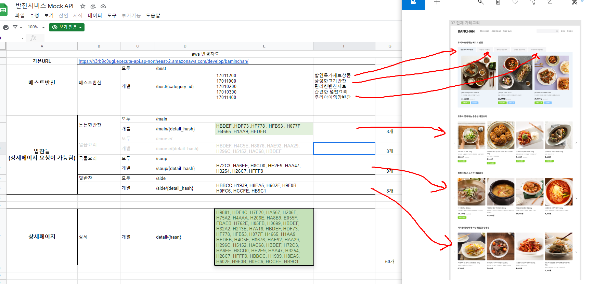
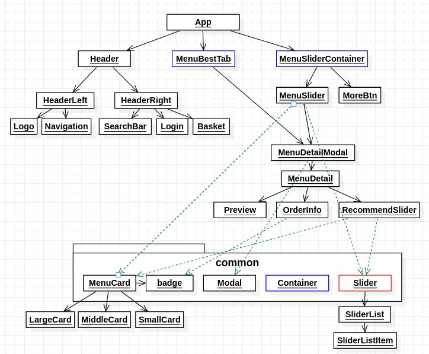
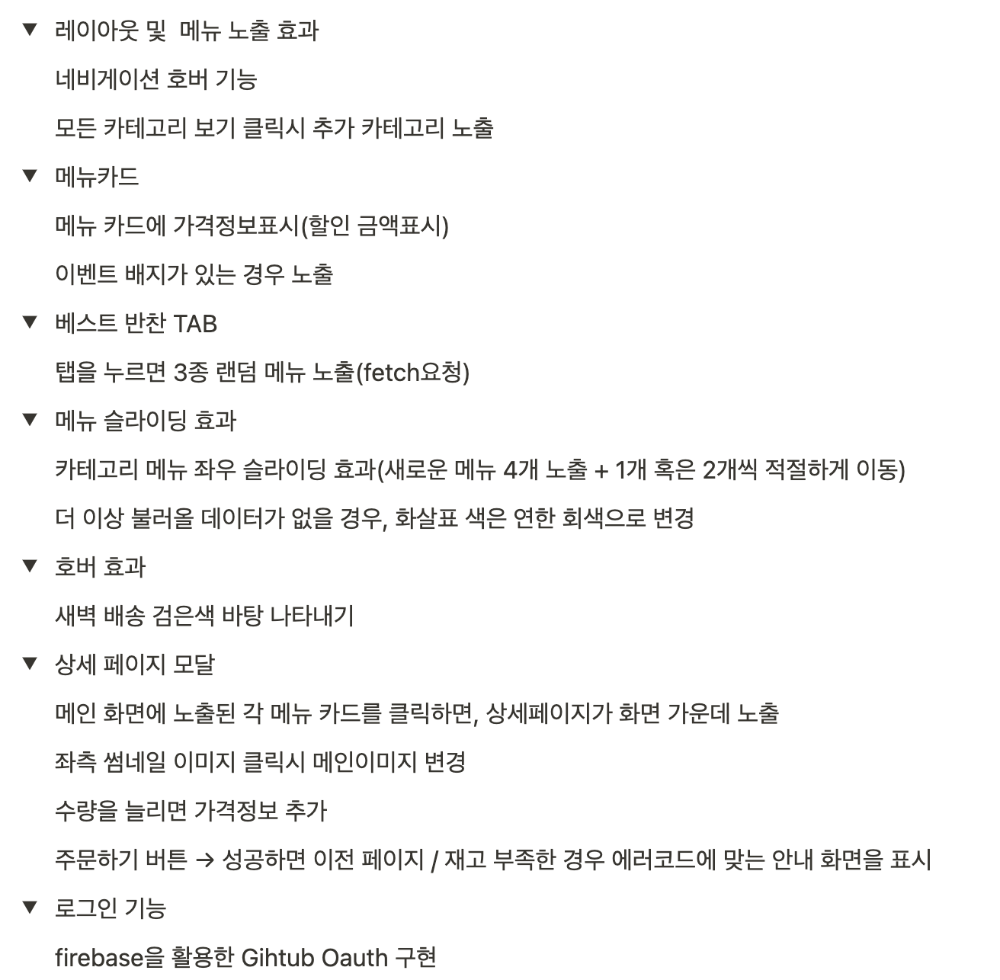

# SideDish 프로젝트 - ( Neis, Young)

## Demo

## 기획서 분석

## Architecture (last updated: 2021-04-23)

## 구현사항

## Github project

- [https://github.com/zel0rd/sidedish/projects/1#card-59405951](https://github.com/zel0rd/sidedish/projects/1#card-59405951)

### slider 컴포넌트 설계

#### Case1

#### Case2

**Case1**와 **Case2**의 경우처럼 슬라이드하는(왼쪽, 오른쪽) 버튼을 라이브러리 사용자가 커스터마이즈할 수 있도록 구현할 것이다. 이로 인해 `useImperativeHandle()`과 `forwardRef()` 의 사용은 불가피할 것으로 보인다.

부모의 사이즈, 한 아이템의 사이즈, 한 번에 보여질 아이템 수(`itemCntOnView`)를 고려하여, 부모의 사이즈에 `itemCntOnView`만큼의 아이템이 균등하게 퍼져서 보일 수 있도록 구현하였음.

### **Parameter**

- `itemCntOnView`: 한 번에 보여질 아이템의 개수
  - TODO: 1일 경우에 대한 구현
- `items`: 아이템 컴포넌트 배열
- `defaultBtn`(미구현):
  - _boolean_
  - 커스터마이즈 버튼을 사용할 지에 대한 여부
- `pageable`(미구현):
  - _boolean_
  - 페이지 표시 여부 (현재 페이지, 총 페이지)
  - `itemCntOnView` 로 아이템 컴포넌트의 수가 나눠떨어지지 않을 때 처리를 어떻게 할 것인가?
    - 나머지 아이템들이 하나의 페이지를 차지할 것인지에 대한 여부
